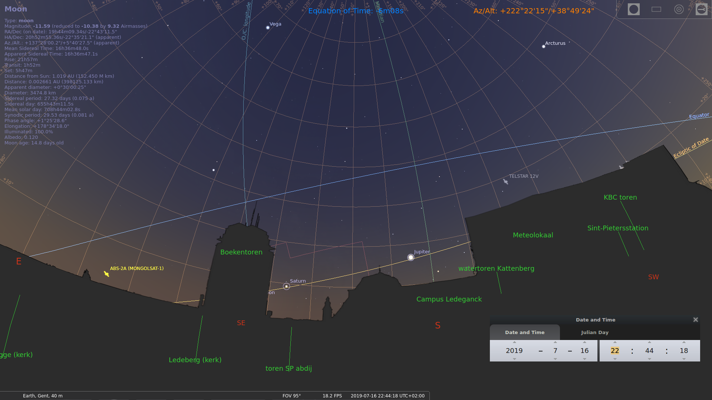

===============
VSRUG landscape
===============

VSRUG landscape file for use in `Stellarium <https://stellarium.org/>`_.

How to calibrate
----------------

observer spot
+++++++++++++

First, find the exact spot from this photo:

.. image:: https://raw.githubusercontent.com/axd1967/vsrug-ls-gr/a8e18c1460b29ae744af2113d301c18e411f58ce/panovsrug.png

(TODO: make a new picture that better shows the observer spot)

sky
+++

Calibration requires to tweak three parameters of the `texture file <landscape.ini>`_:

- ``angle_rotatez``: azimuth shift
- ``maptex_top``, ``maptex_bottom`` : top and bottom extent of the `panoramic photo <panovsrug_mask.png>`_

Best is to choose specific bodies (Moon, stars, planet) and specific events such as a passage above a pole, from behind a wall, etc... Ideally this requires an accurate time piece (seconds matter!).
